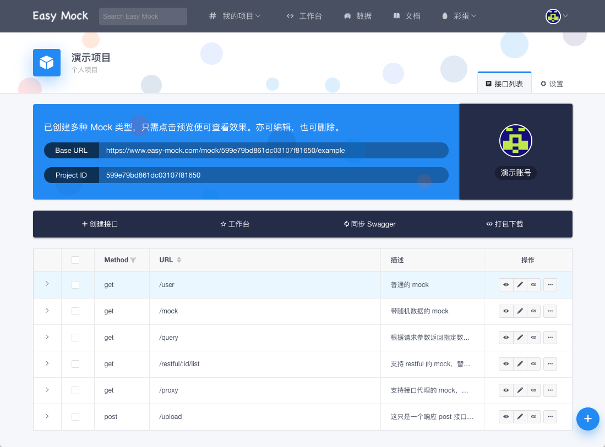
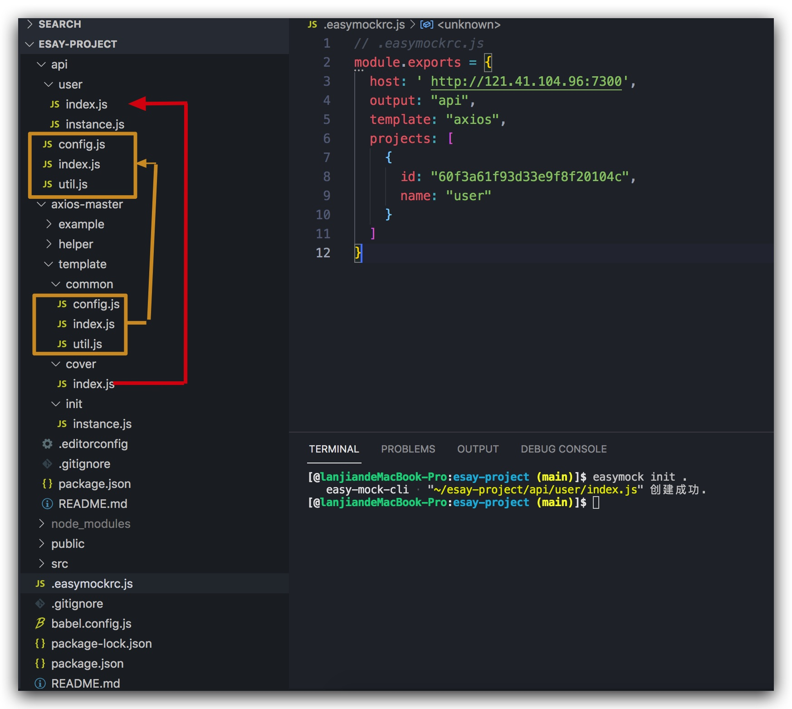

背景: 团队没有mock工具, 开发效率低下，需要一款好用的mock解决方案. 自研没有时间和人力

为什么使用easyMock: Easy Mock 是一个可视化的能快速生成模拟数据的持久化服务, 使用简单, 功能强大且开源.

一. 服务器搭建easyMock

1. 服务器使用nvm控制node版本 [node版本 必须为8.x, 否则会报错]

2. docker 部署MongoDB服务 [27017端口]

3. docker 部署redis服务 [6379端口]

4. 部署Easy-Mock项目 [7300端口]

```
// 1. 服务器clone代码
  cd /usr/libra
  git clone https://github.com/easy-mock/easy-mock.git
  ## 安装依赖
  cd easy-mock && npm install

// 2. 配置服务器安全组规则并开启7300端口
```

4. 使用PM2 对node进程守卫



二. easy-mock的使用

1. 手动创建
2. 基于swagger创建项目
3. 基于json创建项目

三. 基于easy-mock-cli的API自动生成

npm install easy-mock-cli

> 配置文件
  1. 文件格式

  * json
  * yml
  * ymal
  * js

  2. 配置参数
  
  | 属性  |  描述  |
  |  ----  | ----  |
  | host  | 获取接口数据的源【你的服务器地址】 |
  | output  | 生成 API 的基础目录 |
  | template | 指定一个 API 模板【决定了你生成的文件】 |
  | projects | 项目列表 |

  3. 示例

  ```
  {
    "output": "api",
    "template": "axios",
    "projects": [
      {
        "id": "你要创建的 Easy Mock 项目的 id",
        "name": "demo"
      }
    ]
  }
  ```

  4. 生成api文件

  ```
  easymock init .
  ```

> API模板

1. 模版目录

```
.
├── helper, 自定义方法，并在模板中使用
│   └── index.js
└── template
    ├── common, 只创建一次
    ├── cover, 只创建一次
    └── init, 每次覆盖式创建

```



2. 自定义模版完成业务需求开发

3. 业务流程
```
graph TB
s(/bin/easymock-init) --> step1>downloadAndGenerate]
step1 --> step2{generate}
step2 --> step3(api/mock/by_projects 获取项目mock数据)
step3 --> step4(循环cove更新)
```

四. 其他操作
  1. 开发easy-mock vue Cli插件 easy-mock-plugin
  使用vue-cli Generator 生成模板, 安装依赖, 添加一个新的 cli-service 命令

五. 不足

  1. 平台没有mock分类功能
  2. 对于旧项目[已经自己处理过api接口的项目]兼容不够