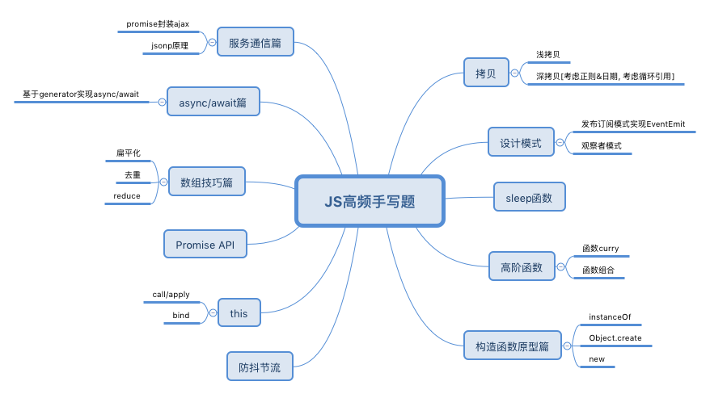

### HandWrite Topic



> 浅拷贝

```
const shallClone = (target) => {
  if (typeof target === 'object' && target !== null) {
    const cloneTarget = Array.isArray(target)?[]: {}

    for(let prop in target) {
      if (target.hasOwnProperty(prop)) {
        cloneTarget[prop] = target[prop]
      }
    }
    return cloneTarget
  } else {
    return target
  }
}
```

> 深拷贝

```
#简易版
const deepClone = (target) => {
  if (typeof target !== 'object') return
  const cloneTarget = Array.isArray(target)?[]: {}

  for(let prop in target) {
    if (target.hasOwnProperty(prop)) {
      cloneTarget[prop] = typeof target[prop] === 'object'? deepClone(target[prop]): target[prop]
    }
  }
  return cloneTarget
}

#进阶版
const isObject = (target) => (typeof target === 'object' || typeof target === 'function') && target !== null
function deepClone(target, map = new Map()) {
  // 先判断该引用类型是否被 拷贝过
  if (map.get(target)) {
    return target
  }

  let constructor = target.constructor
  if (/(RegExp|Date)/i.test(constructor.name)) {
    return new constructor(target) // 创建一个新的特殊对象(正则类/日期类)的实例
  }

  // 获取当前值的构造函数：获取它的类型
  if (isObject(target)) {
    map.set(target, true) // 为循环引用的对象做标记
    const cloneTarget = Array.isArray(target) ? [] : {}
    for (let prop in target) {
      if (target.hasOwnProperty(prop)) {
        cloneTarget[prop] = deepClone(target[prop], map)
      }
    }
    return cloneTarget
  } else {
    return target
  }
}
```

> instanceOf: 对象的原型链上是否有当前构造函数的 prototype 属性

```
function _instanceof (instanceObject, classFunc){
  let classFuncProp = classFunc.prototype
  let proto = instanceObject.__prop__

  while(true) {
    if (proto === classFuncProp) return true
    proto = proto.__prop__
    if (!proto) return false
  }
}
```

> 防抖

> 节流

> Object.create

> new

```
function _new(Func) {
  const obj = {}
  obj.__proto__ = Func.prototype

  return typeof Func.call(obj) === Object?Func.call(obj): obj
}

```

> call, apply, bind

```
Function.prototype.call = function(context, ...args) {
  context = context == null? window: context

  context[fn] = this
  let result = context[fn](...args)
  delete context[fn]
  return result
}

Function.prototype.bind = function(context) {
  let _this = this
  return function() {
    _this.call(context)
  }
}
```

> 基于 Generator 函数实现 async/await 原理

> curry

```
function curry(fn, ...args) {
  if (fn.length === args.length) {
    return fn(...args)
  }

  return function(){
    let allArgs = [...args, ...newArgs]
    return currying(fn, ...allArgs)
  }
}
```

> 继承

> 发布订阅模式

> 观察者模式

> 请实现如下函数，可以批量请求数据,所有的 url 地址在 urls 参数中，同时可以通过 max 参数控制请求的并行数，当所有请求结束之后，需要执行 callback 回调函数，发送请求的函数可以直接使用 fetch 即可

> 红, 黄, 绿 轮流亮

> new Queue().tasj(1000, () => console.log(1)).task(2000, () => cnosole.log(2)).task(3000, () => console.log(3)).start()

> promise.all
