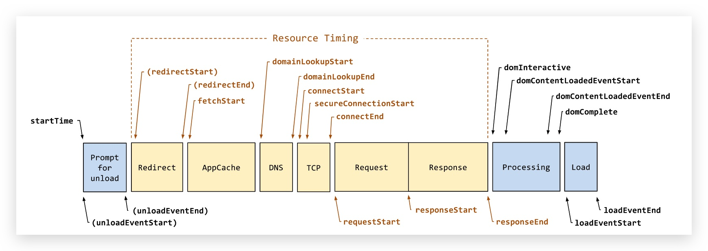

# 概述

[前端开发核心知识进阶](https://gitbook.cn/gitchat/column/5c91c813968b1d64b1e08fde/topic/5c99bd37ccb24267c1d01ac7)


> Event Loop

```
   ┌───────────────────────┐
┌─>│        timers         │<————— 执行 setTimeout()、setInterval() 的回调
│  └──────────┬────────────┘
|             |<-- 执行所有 Next Tick Queue 以及 MicroTask Queue 的回调
│  ┌──────────┴────────────┐
│  │     pending callbacks │<————— 执行由上一个 Tick 延迟下来的 I/O 回调（待完善，可忽略）
│  └──────────┬────────────┘
|             |<-- 执行所有 Next Tick Queue 以及 MicroTask Queue 的回调
│  ┌──────────┴────────────┐
│  │     idle, prepare     │<————— 内部调用（可忽略）
│  └──────────┬────────────┘
|             |<-- 执行所有 Next Tick Queue 以及 MicroTask Queue 的回调
|             |                   ┌───────────────┐
│  ┌──────────┴────────────┐      │   incoming:   │ - (执行几乎所有的回调，除了 close callbacks、timers、setImmediate)
│  │         poll          │<─────┤  connections, │
│  └──────────┬────────────┘      │   data, etc.  │
│             |                   |               |
|             |                   └───────────────┘
|             |<-- 执行所有 Next Tick Queue 以及 MicroTask Queue 的回调
|  ┌──────────┴────────────┐
│  │        check          │<————— setImmediate() 的回调将会在这个阶段执行
│  └──────────┬────────────┘
|             |<-- 执行所有 Next Tick Queue 以及 MicroTask Queue 的回调
│  ┌──────────┴────────────┐
└──┤    close callbacks    │<————— socket.on('close', ...)
   |_______________________|
```

> 首屏优化



- CDN 分发
- 静态资源缓存
- 前端的资源动态加载

```
a. 路由动态加载, 最常用的做法, 以页面为单位, 进行动态加载
b. 组件动态加载(offScreen Component), 对于不在当前视窗的组件, 先不加载
c. 图片懒加载(offScreen Image), 同上.值得庆幸的是, 越来越多的浏览器支持原生的懒加载, 通过给img标签加上loading="lazy来开启懒加载模式
```

- 减少请求数
- 页面使用骨架屏
- ssr 渲染

> CDN 原理

目的是使用户可就近取得所需内容

> 怎么捕获异步事件的报错

- try catch 无法捕获异步错误
- Promise 的异常捕获 catch, error 会传递到下一个 then 的回调
- 用 promise 捕获异步错误

```
const p3 = () =>  new Promise((reslove, reject) => {
  setTimeout(() => {
    reject('async error');
  })
});

function main3() {
  p3().catch(e => console.log(e));
}
main3();
```

- async/await 异常捕获

```
const fetchFailure = () => new Promise((resolve, reject) => {
  setTimeout(() => {// 模拟请求
    if(1) reject('fetch failure...');
  })
})

async function main () {
  try {
    const res = await fetchFailure();
    console.log(res, 'res');
  } catch(e) {
    console.log(e, 'e.message');
  }
}
main();

```

> 内存益处

- 全局变量
- 未及时清理计时器或回调函数
- 闭包
- DOM 绑定时间未清理
