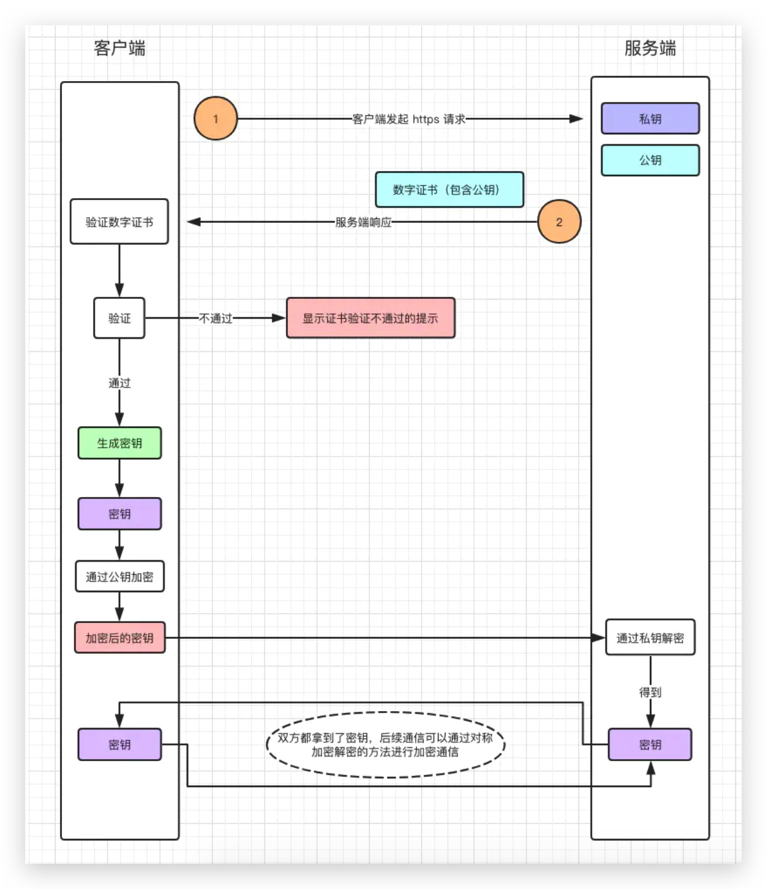

> 攻击类型

- 窃听
- 伪造
- 否认

> 对称密钥加密

> 公开密钥加密

> 中件人攻击

通过秘密替换公钥窃取数据的方法被称为“中间人攻击”, 问题的根源在于 A 无法确认他们收到的公钥是否由 B 方创建

> 消息鉴别码[解决了伪造的问题]

MAC 可以理解为密钥和密文组成的字符串的哈希值
MAC & MAC 私钥

> 数字签名[解决否认问题]

签名&签名私钥

> 数字证书[解决中间人攻击]

> https 过程

[图解 https](https://juejin.cn/post/6844903764399243278)
