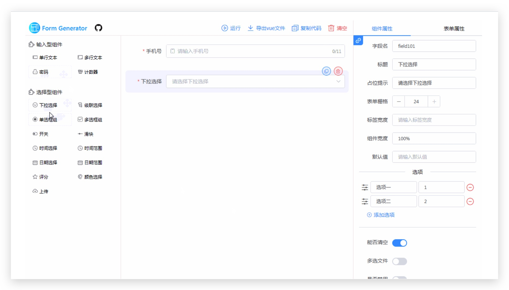
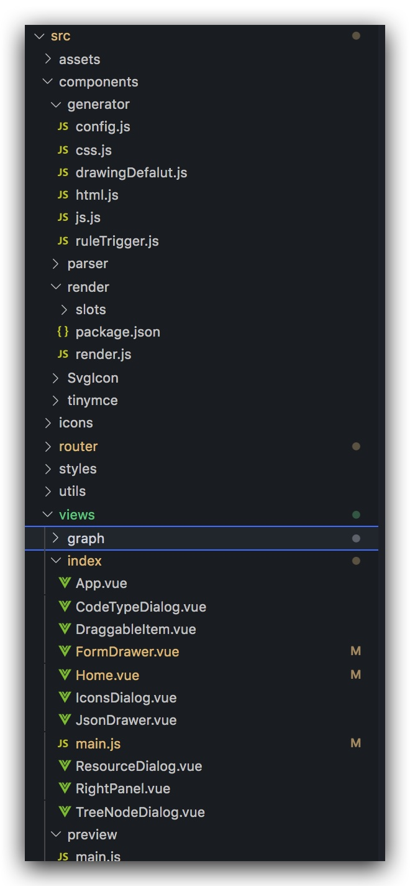

> 配置化页面生成平台

> 背景

中后台系统需求复杂度较低, 至少 90% 的页面可以形成标准化.所以大量人员投入在重复性的工作上.实现业务需求，还提供权限、环境、灰度、埋点、监控等能

基于组件化的搭建

> 存在问题

- 交互逻辑需要侵入开发，无法自动生成
- 只能在受限、具体的业务场景下发挥作用

> 怎么设计

- 需要有丰富的模板、组件玩法满足各种业务场景
- 需要有易用的可视化编辑器，所见即所得
- 需要有页面发布能力，支持编辑后页面随时发布上线?
- 稳定性，保障线上项目安全稳定运行?

> 未解决的问题

- 接口层⾯临的痛点
- 业务模版开发

> 项目结构

