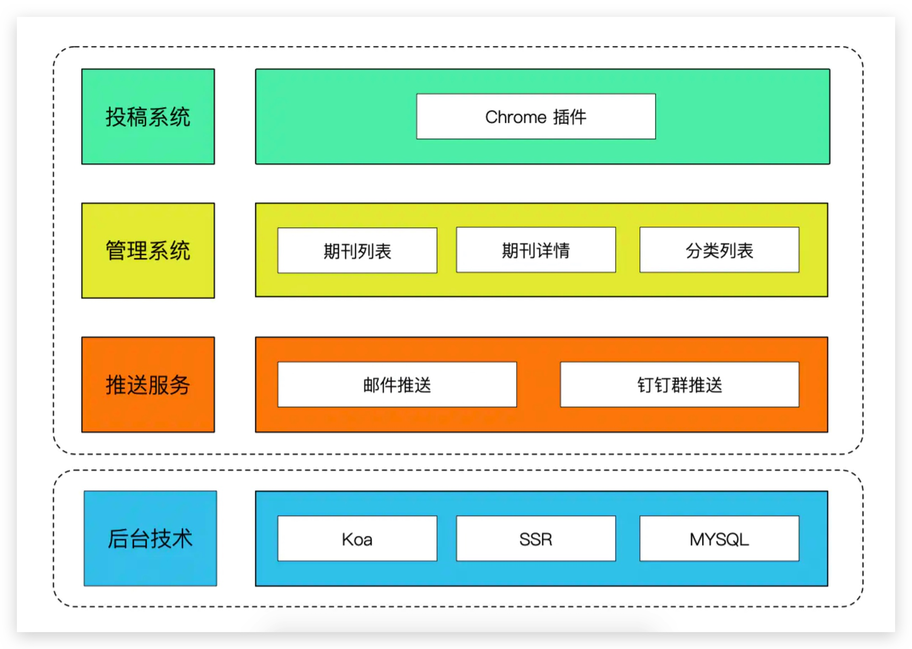

# 小报系统

[手把手教你打造属于自己团队的前端小报系统](https://juejin.cn/post/6854573219895050247)
[小报系统](https://juejin.cn/post/6882295776454639624)

> 背景

团队营造一个持续学习的氛围

> 功能

- 投稿
- 汇总沉淀
- 定时投递

> 整体设计



```
|- controllers
          |- auth.ts
                 |- validate
                 |- login
                 |- register
          |- user.ts
                |- listUsers
                |- showUserDetail
                |- updateUser
                |- deleteUser
          |- article.ts
                   |- listArticles
                   |- addArticle
          |-
|
|- entity
      |- user: id, name, password, email
      |- article: id, title, desc, link, tag, user, weekId
      |- week: id, title, articleIds
|
|- units
|
|- types
|
|- index.ts
        |- 使用的中间件: typeorm, koa-jwt, koa-body
|
|- router.ts
         |- unprotectedRouter.post('/auth/validate', AuthController.validate)
```

> chrome 插件开发

> 汇总与推送

邮箱推送使用的是 nodemailer npm 包，按照文档进行设置即可，而定时推送是通过 linux 内置的 cron 进程实现的

> 小报展示系统

nuxt 开发，实现服务端渲染
